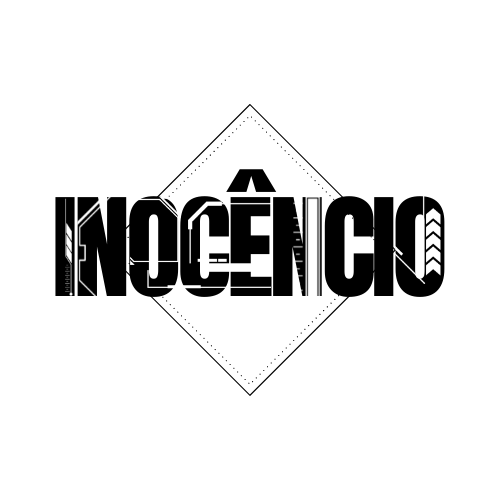

<h1 align="center" id="title">IN0C3NC10 - WebProfile</h1>
<!-- Logo -->
<p align="center">
  
</p>


<!-- Título&Descrição -->
<h2 align="left" id="descricao">Descrição</h2>
<p align="justify">
  Este é um website simples, desenvolvido para eu exibir os poucos trabalhos que desenvolvi como também para reforçar meus conhecimentos em CSS e JavaScript, trabalhando com modal, overlay e componentes dinâmicos no HTML.
</p>


<!-- Shields -->
<p>
	</img>
  </img>
  </img>
  <!--</img>-->
  </img>
</p>


<!-- Executando o app -->
<h2 align="left" id="run">Rodando o website</h2>

```bash
# Clone este repositório
$ git clone https://github.com/IN0C3NC10/IN0C3NC10-Website.git

# Muito difícil, clique 2x no arquivo com nome index.hml e aí... bem, é isso! =P

#LetsCoding!
```
<!-- Autor -->
<h2 align="left" id="autor">Autor</h2>
<p>
	<a href="https://github.com/IN0C3NC10">
		
	</a>
	<br />
	Feito com ❤️ por <strong>Bruno Inocencio</strong>!
</p>

<p align="left">
  <!-- Outlook -->
  <a href="mailto:bruno.inocencio@fatec.sp.gov.br" alt="Outlook" target="_blank">
    
  </a>
  <!-- Linkedin -->
  <a href="https://cutt.ly/nQlVjQV" alt="Linkedin" target="_blank">
    
  </a>
  <!-- GitHub -->
  <a href="https://github.com/IN0C3NC10" alt="GitHub" target="_blank">
    
  </a>
</p>
